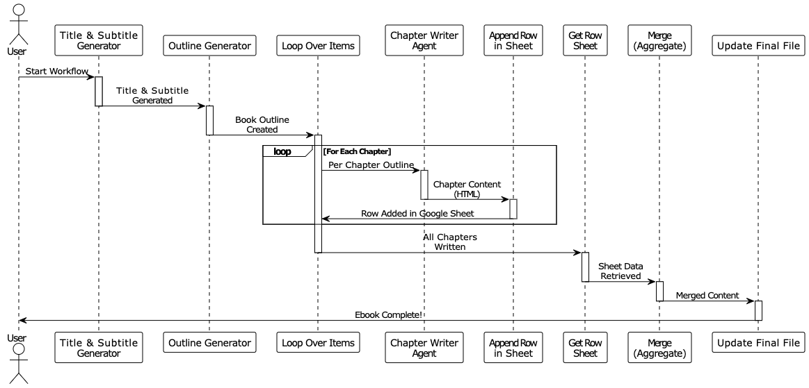

<picture>
  <source media="(prefers-color-scheme: dark)" srcset="atmlab-white@4x.webp">
  <source media="(prefers-color-scheme: light)" srcset="atmlab-black@4x.webp">
  
</picture>
#

At ATM-Labs, we design intelligent automation workflows and AI agents that simplify complex, repetitive tasks so that your operations become faster, smoother, and more reliable every time.

We focus on building scalable, user-friendly systems that help businesses reduce manual work, minimize errors, and improve productivity. Whether it's process automation, AI-driven decision support, or custom workflow design, our solutions are tailored to fit real-world needs and grow with your business.

You can know more about us and our exeprtise using the links below:
- 🌐 **Website:** https://atm-labs.io  
- 📁 **Portfolio:** https://atm-labs.io/workflows

From idea to implementation, we turn complex processes into clean, repeatable systems that teams can use confidently again and again. If you want to make an automation system of your own, we can build that for you. You can contact us using the email below:
- 📩 **Contact:** workflow@atm-labs.com

# AI-Powered Ebook Generator Workflow

This workflow generates professionally structured ebooks using AI automation.

Below is the sequence diagram showing how the system carries out this task.

## How It Works

This n8n automation creates complete ebooks from concept to finished manuscript using AI agents, structured output parsing, and intelligent document assembly. Here's how the process unfolds:

**Define the Book's Personality**  
The Edit Fields node lets you specify six key parameters that shape the entire book: Topic (the subject matter), Tone (the emotional quality), Clarity Level (how explicit the explanations are), Target Mindset (the psychological state you want readers to achieve), Framing Style (the approach to transformation), and Energy Intensity (the pacing and vigor of the content).

**Generate Title and Subtitle**  
The Title & Subtitle Generator AI Agent creates an attention-grabbing title that clearly communicates the topic and a compelling 5-12 word subtitle focused on reader benefits.

**Create the Document**  
The Google Docs node establishes an empty document as the book's final destination, titled "Ebook: [Generated Title]" in your specified Google Drive folder.

**Structure the Outline**  
The Outline Generator AI Agent creates a professionally organized outline. You define the number of chapters (default: 5), sections per chapter (2-4), and sub-sections (2-4). The AI follows publishing standards with hierarchical section numbering (X.Y for sections, X.Y.Z for sub-sections).

**Process Chapters Sequentially**  
The Loop Over Items node iterates through each chapter one at a time, ensuring organized batch processing and preventing the AI from being overwhelmed with simultaneous requests.

**Write Complete Chapters**  
The Chapter Writer Agent acts as your dedicated ghostwriter. For each chapter, it generates 900-1200 words of professionally authored content following a specific narrative flow: hook → original story with tension → transition to core lesson → conversational teaching → frameworks/metaphors → practical examples → uplifting close. The agent maintains your specified tone, clarity level, target mindset, framing style, and energy intensity throughout.

**Convert to HTML**  
The Markdown node transforms the AI-generated markdown content into HTML format suitable for Google Docs import.

**Store Temporarily**  
The Append Row in Sheet Google Sheets node creates a sequential collection of all chapter content.

**Merge and Format**  
After the loop completes, all HTML chapter contents are merged and formatted for Google Docs. This combines all chapter content with proper multipart/related formatting, wraps it in a complete HTML document structure with styling (margins, spacing, link colors), and prepares it for upload to Google Docs via the API.

**Publish the Ebook**  
The UpdateGoogleDoc HTTP Request node uses the Google Drive API to patch the previously created empty document with the complete, formatted ebook content.

## Setup Instructions

Follow these steps to get the AI-powered ebook generator running:

**Import the Workflow**  
Import the JSON file into your n8n instance.

**Add API Credentials**  
Configure the following credentials:
- OpenAI API key for the AI Agents (GPT-4.1 model)
- Google Docs OAuth2 credentials for document creation
- Google Sheets OAuth2 credentials for temporary storage
- Google Drive OAuth2 credentials for document updates

**Configure Google Drive**  
Create or select a folder where generated ebooks will be stored. Copy the folder ID from the folder's URL and update the "Create a document" node with this folder ID.

**Set Up Temporary Storage**  
Create a new Google Sheet with a single column header labeled "Chapter Content." Copy the document ID from the sheet's URL and update all Google Sheets nodes (Append row, Get row(s), Delete rows) with this document ID.

**Customize Book Parameters**  
In the Edit Fields node, configure:
- Topic: the book's subject matter
- Tone: Calm, Energetic, Professional, Inspirational, etc.
- Clarity Level: Explicit, Semi-Explicit, Implicit
- Target Mindset: Self-Trusting, Growth-Oriented, Action-Driven, etc.
- Framing Style: Identity Shift, Problem-Solution, Step-by-Step, etc.
- Energy Intensity: Low, Medium, High

**Adjust Book Structure**  
In the Edit Fields1 node, set:
- Number of Chapters (default: 5)
- Number of Segments per chapter (default: 2-4)
- Number of Sub-segments per section (default: 2-4)

**Test and Refine**  
Set your parameters and click "Execute workflow" to generate a sample ebook. Review the generated Google Doc and adjust parameters or system messages as needed.

**Deploy**  
Use the workflow whenever you need to create a new ebook by simply updating the topic and parameters.

## Requirements

Before running the workflow, ensure you have:

- An n8n account or instance (self-hosted or n8n Cloud)
- OpenAI API access with sufficient credits for GPT-4.1 model usage (approximately 3-5 API calls per chapter)
- A Google Cloud project with Google Docs API, Google Sheets API, and Google Drive API enabled
- Google OAuth2 credentials configured for Docs, Sheets, and Drive access
- A designated Google Drive folder for storing generated ebooks
- A Google Sheet configured for temporary chapter storage with a "Chapter Content" column
- Basic understanding of n8n workflows, AI agents, and structured output parsers
- Familiarity with markdown formatting and HTML structure (optional but helpful)

## Customization Options

This workflow is highly flexible and can be tailored to fit your specific book creation needs:

**Change the Genre or Style**  
Modify the Chapter Writer Agent's system message to write fiction, technical documentation, business guides, self-help books, or any other genre. Adjust the narrative flow, tone requirements, and structural elements to match your target format.

**Adjust Chapter Length**  
Change the word count range in the Chapter Writer Agent's instructions. The default is 900-1200 words, but you can increase it to 1500-2000 for more comprehensive chapters or decrease it to 500-800 for shorter, punchier content.

**Modify the Outline Structure**  
In the Edit Fields1 node, create more or fewer chapters, sections, and sub-sections. Generate anything from a short 3-chapter guide to a comprehensive 15-chapter book.

**Add Creative Parameters**  
Expand the Edit Fields node with additional customization options like Reading Level (beginner, intermediate, advanced), Perspective (first-person, second-person, third-person), Example Types (case studies, personal stories, research-based), or Visual Elements (include diagrams, tables, callout boxes).

**Implement Multi-Language Support**  
Add a "Language" parameter to the Edit Fields node and incorporate language-specific instructions in both the Title & Subtitle Generator and Chapter Writer Agent system messages.

**Create Chapter Templates**  
Add conditional logic nodes that apply different writing styles or structures to specific chapters, such as using a different template for introduction chapters versus body chapters.
